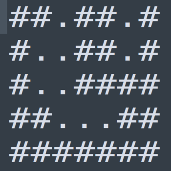
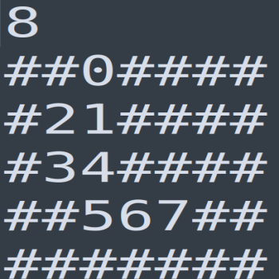

# C++ Challenge

Finding the largest pathway moving only between holes, reading the labyrinth schema from <b>schema.txt</b>


## Build

```
mkdir build && cd build 
cmake ../
make
```


## Run

```
./execute
```


## Output path

/build/output.txt


## Images

input                      |  output
:-------------------------:|:-------------------------:
      |  


