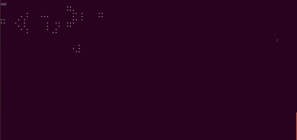

# Python Challenge

Implementation of [Conway's Game of Life](https://en.wikipedia.org/wiki/Conway%27s_Game_of_Life) in python and executed from the terminal. 


## Requirements
- NumPy


## Steps to run
```
python3 app.py
```


## Working gifs

##### Random  


##### Glider


##### Light weight spaceship


##### Glider gun



## Test-output
```
test_beacon (__main__.TestGame) ... ok
test_beehive (__main__.TestGame) ... ok
test_pattern_adding (__main__.TestGame) ... ok
test_window (__main__.TestGame) ... ok

----------------------------------------------------------------------
Ran 4 tests in 0.009s

OK
```
